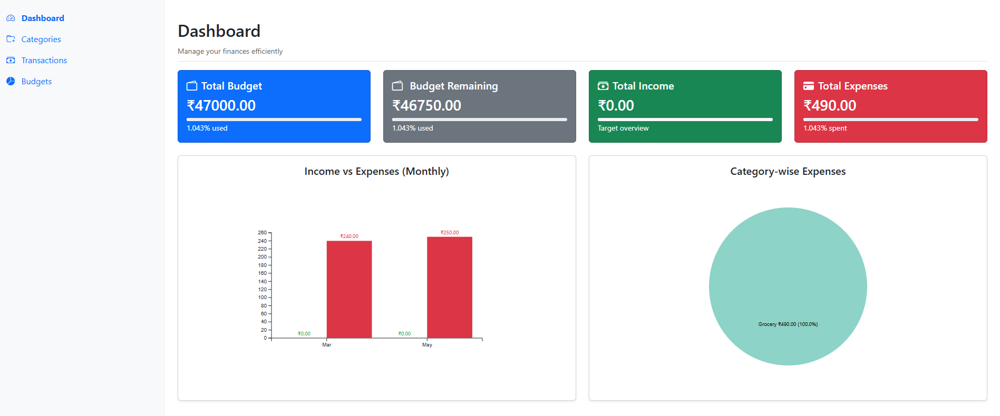
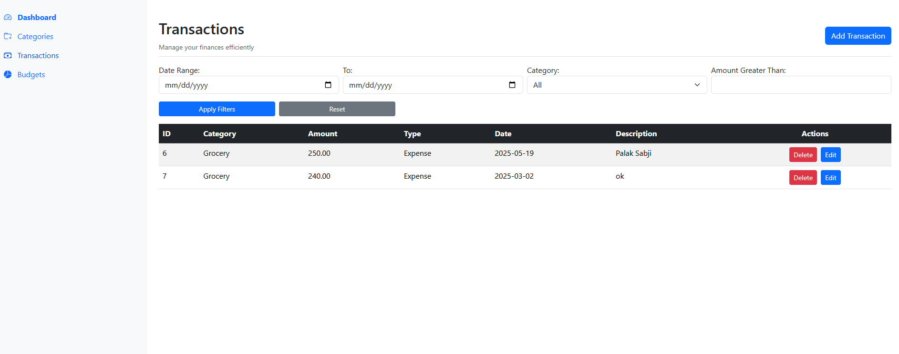
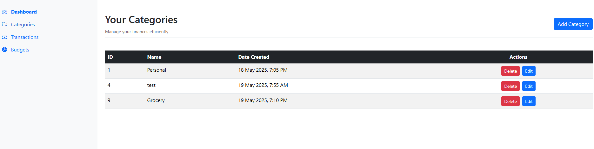
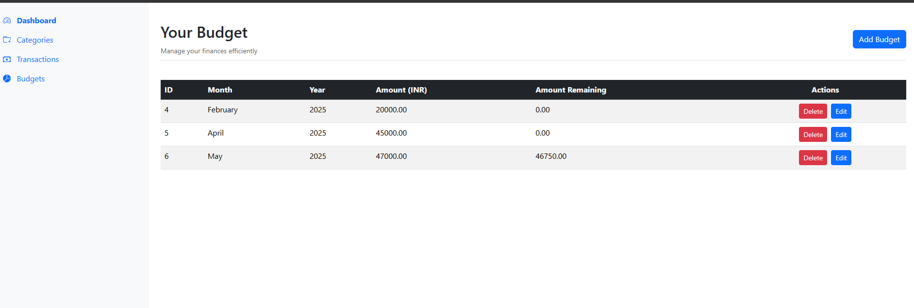
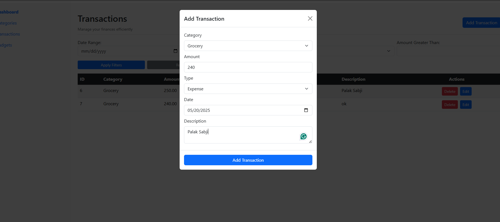

# 💸 Financial Dashboard – Budget & Expense Tracker

A modern web application to help users **track expenses, manage budgets**, and **visualize financial data** with beautiful, interactive charts. Built using Angular and Django REST Framework.

🌐 **Live App**: [https://budget-tracker-frontend-ten-kappa.vercel.app/](https://budget-tracker-frontend-ten-kappa.vercel.app/)  
📦 **GitHub Repo**: [https://github.com/samarth1011/budget-tracker](https://github.com/samarth1011/budget-tracker)

---

## 🚀 Features

### 📊 Dashboard
- Overview of total income, expenses, and budget left
- Monthly income vs. expense chart
- Category-wise expense pie chart
- Budget usage bar chart

### 🧾 Transactions
- Add, edit, and delete income or expense entries
- Advanced filtering: date range, category, and amount
- Pagination and clear visual layout

### 🗂️ Categories
- Add and manage custom expense categories
- Categories dynamically integrated into filters and dashboards

### 📈 Budgets
- Set monthly spending budgets
- Monitor actual vs. budgeted expenses
- View usage trends visually

---

## 🛠 Tech Stack

| Layer     | Technology       |
|-----------|------------------|
| Frontend  | Angular, Bootstrap 5 |
| Backend   | Django + Django REST Framework |
| Charts    | D3.js (for all financial visualizations) |
| Auth      | JWT-based Authentication (optional setup) |
| Hosting   | Vercel (Frontend), VPS/Hostinger (Backend) |

---

## 🖼️ UI Preview

> Responsive, clean layout with intuitive navigation  
> Smart filters, CRUD operations, and real-time charts  
>  
>
>
>
>
>

---

## 🔧 Getting Started

### Backend – Django
```bash
cd budget_tracker/
python -m venv venv
source venv/bin/activate  # For Windows: venv\Scripts\activate
pip install -r requirements.txt
python manage.py migrate
python manage.py runserver

cd budget-tracker-frontend/
npm install
ng serve

```
Then visit: http://localhost:4200

---

## 🧪 API Endpoints (Django REST)

- GET/POST /api/transactions/

- GET/POST /api/categories/

- GET/POST /api/budgets/

## 📊 Visualizations

- Built using D3.js and Angular, including:

- Line chart for monthly trends

- Pie chart for category distribution

- Progress bars for budget usage

